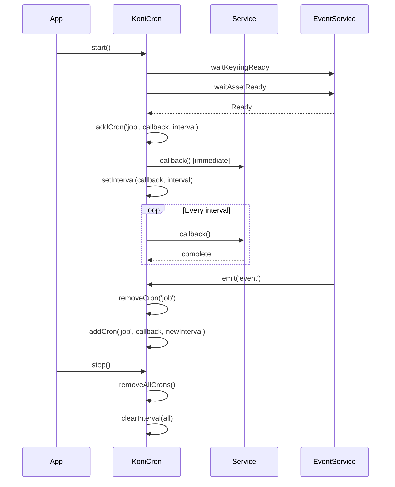

## What are Cron Jobs?

Cron jobs in SubWallet Extension are scheduled background tasks that run periodically in the background environment. They handle time-sensitive operations like price updates, NFT refreshes, staking reward calculations, and other recurring data synchronization tasks.

Cron jobs provide:
- **Automatic data refreshes** without user interaction
- **Background processing** that doesn't block the UI
- **Resource optimization** through scheduled execution
- **Event-driven updates** based on application state changes

## Cron Architecture

The cron system is managed by the `KoniCron` class located in `packages/extension-base/src/koni/background/cron.ts`.

### KoniCron Class Structure

```typescript
export class KoniCron {
  subscriptions: KoniSubscription;
  public status: 'pending' | 'running' | 'stopped' = 'pending';
  private serviceSubscription: Subscription | undefined;
  public dbService: DatabaseService;
  private state: KoniState;
  private cronMap: Record<string, any> = {};
  private subjectMap: Record<string, Subject<any>> = {};
  private eventHandler?: ((events: EventItem<EventType>[], eventTypes: EventType[]) => void);

  constructor (state: KoniState, subscriptions: KoniSubscription, dbService: DatabaseService) {
    this.subscriptions = subscriptions;
    this.dbService = dbService;
    this.state = state;
  }
}
```

## Cron Job Methods

### Adding a Cron Job

```typescript
addCron = (name: string, callback: (param?: any) => void, interval: number, runFirst = true) => {
  if (runFirst) {
    callback();
  }

  this.cronMap[name] = setInterval(callback, interval);
};
```

**Parameters:**
- `name`: Unique identifier for the cron job
- `callback`: Function to execute on each interval
- `interval`: Time in milliseconds between executions
- `runFirst`: Whether to run immediately before scheduling

### Adding a Subscribable Cron Job

```typescript
addSubscribeCron = <T>(name: string, callback: (subject: Subject<T>) => void, interval: number) => {
  const sb = new Subject<T>();

  callback(sb);
  this.subjectMap[name] = sb;
  this.cronMap[name] = setInterval(callback, interval);
};
```

This creates a cron job that emits updates through an RxJS Subject, allowing components to subscribe to changes.

### Removing a Cron Job

```typescript
removeCron = (name: string) => {
  const interval = this.cronMap[name] as number;

  if (interval) {
    clearInterval(interval);
    delete this.cronMap[name];
  }
};
```

### Starting the Cron System

```typescript
start = async () => {
  if (this.status === 'running') {
    return;
  }

  await Promise.all([this.state.eventService.waitKeyringReady, this.state.eventService.waitAssetReady]);

  const currentAccountInfo = this.state.keyringService.context.currentAccount;

  // Setup event handlers for dynamic cron management
  this.eventHandler = (events, eventTypes) => {
    // Handle events and restart relevant crons
  };

  this.state.eventService.onLazy(this.eventHandler);

  // Initialize cron jobs
  this.addCron('fetchPoolInfo', this.fetchPoolInfo, CRON_REFRESH_CHAIN_STAKING_METADATA);
  this.addCron('fetchMktCampaignData', this.fetchMktCampaignData, CRON_REFRESH_MKT_CAMPAIGN_INTERVAL);

  if (currentAccountInfo?.proxyId) {
    this.resetNft(currentAccountInfo.proxyId);
    this.addCron('refreshNft', this.refreshNft(/* params */), CRON_REFRESH_NFT_INTERVAL);
    this.addCron('detectNft', this.detectEvmCollectionNft(currentAccountInfo.proxyId), CRON_NFT_DETECT_INTERVAL);
    this.addCron('syncMantaPay', this.syncMantaPay, CRON_SYNC_MANTA_PAY);
  }

  this.status = 'running';
};
```

### Stopping the Cron System

```typescript
stop = async () => {
  if (this.status === 'stopped') {
    return;
  }

  // Unsubscribe events
  if (this.eventHandler) {
    this.state.eventService.offLazy(this.eventHandler);
    this.eventHandler = undefined;
  }

  if (this.serviceSubscription) {
    this.serviceSubscription.unsubscribe();
    this.serviceSubscription = undefined;
  }

  this.removeAllCrons();
  this.stopPoolInfo();

  this.status = 'stopped';

  return Promise.resolve();
};
```

## Common Cron Jobs in SubWallet

### 1. NFT Refresh Cron

```typescript
refreshNft = (address: string, apiMap: ApiMap, smartContractNfts: _ChainAsset[], chainInfoMap: Record<string, _ChainInfo>) => {
  return () => {
    this.subscriptions.subscribeNft(address, apiMap.substrate, apiMap.evm, smartContractNfts, chainInfoMap);
  };
};

// Add the cron job
this.addCron(
  'refreshNft',
  this.refreshNft(address, apiMap, nfts, chainMap),
  CRON_REFRESH_NFT_INTERVAL // 30 seconds
);
```

### 2. Price Update Cron

Implemented in `PriceService`:

```typescript
public refreshPriceData (priceIds?: Set<string>) {
  clearTimeout(this.refreshTimeout);
  this.priceIds = priceIds || this.getPriceIds();

  // Update token prices
  this.getTokenPrice(this.priceIds, DEFAULT_CURRENCY)
    .then(() => {
      this.refreshPriceMapByAction();
    })
    .catch((e) => {
      console.error(e);
    });

  this.refreshTimeout = setTimeout(
    this.refreshPriceData.bind(this),
    CRON_REFRESH_PRICE_INTERVAL // 60 seconds
  );
}
```

### 3. Staking Metadata Cron

```typescript
fetchPoolInfo = () => {
  this.state.earningService.runSubscribePoolsInfo().catch(console.error);
};

this.addCron(
  'fetchPoolInfo',
  this.fetchPoolInfo,
  CRON_REFRESH_CHAIN_STAKING_METADATA // 10 minutes
);
```

### 4. MantaPay Sync Cron

```typescript
syncMantaPay = () => {
  if (this.state.isMantaPayEnabled) {
    this.state.syncMantaPay().catch(console.warn);
  }
};

this.addCron(
  'syncMantaPay',
  this.syncMantaPay,
  CRON_SYNC_MANTA_PAY // 10 seconds
);
```

### 5. Marketing Campaign Cron

```typescript
fetchMktCampaignData = () => {
  this.state.mktCampaignService.fetchMktCampaignData();
};

this.addCron(
  'fetchMktCampaignData',
  this.fetchMktCampaignData,
  CRON_REFRESH_MKT_CAMPAIGN_INTERVAL
);
```

## Creating a New Cron Job

### Step 1: Define the Cron Interval Constant

```typescript
// constants/index.ts
export const CRON_REFRESH_CUSTOM_DATA = 5 * 60 * 1000; // 5 minutes
```

### Step 2: Create the Cron Job Function

In `KoniCron` class:

```typescript
fetchCustomData = () => {
  this.state.customService.refreshData()
    .then(() => {
      console.log('Custom data refreshed');
    })
    .catch((error) => {
      console.error('Failed to refresh custom data:', error);
    });
};
```

### Step 3: Register the Cron Job in Start Method

```typescript
start = async () => {
  // ... existing code ...

  // Add your cron job
  this.addCron(
    'fetchCustomData',
    this.fetchCustomData,
    CRON_REFRESH_CUSTOM_DATA,
    true // Run immediately on start
  );

  this.status = 'running';
};
```

### Step 4: Handle Dynamic Restart (Optional)

If your cron job should restart based on events:

```typescript
this.eventHandler = (events, eventTypes) => {
  const needReload = eventTypes.includes('custom.dataChanged');

  if (needReload) {
    this.removeCron('fetchCustomData');
    this.addCron(
      'fetchCustomData',
      this.fetchCustomData,
      CRON_REFRESH_CUSTOM_DATA
    );
  }
};
```

## Event-Driven Cron Management

KoniCron uses an event-driven approach to dynamically manage cron jobs:

```typescript
this.eventHandler = (events, eventTypes) => {
  const serviceInfo = this.state.getServiceInfo();
  const commonReload = eventTypes.some((eventType) => commonReloadEvents.includes(eventType));
  const chainUpdated = eventTypes.includes('chain.updateState');
  const reloadMantaPay = eventTypes.includes('mantaPay.submitTransaction') || eventTypes.includes('mantaPay.enable');

  if (!commonReload && !chainUpdated && !reloadMantaPay) {
    return;
  }

  const address = serviceInfo.currentAccountInfo?.proxyId;

  if (!address) {
    return;
  }

  // Restart relevant cron jobs based on events
  if (commonReload) {
    this.removeCron('refreshNft');
    this.removeCron('detectNft');
    this.resetNft(address);
    
    if (this.checkNetworkAvailable(serviceInfo)) {
      this.addCron('refreshNft', this.refreshNft(/* params */), CRON_REFRESH_NFT_INTERVAL);
      this.addCron('detectNft', this.detectEvmCollectionNft(address), CRON_NFT_DETECT_INTERVAL);
    }
  }

  if (reloadMantaPay) {
    this.removeCron('syncMantaPay');
    this.addCron('syncMantaPay', this.syncMantaPay, CRON_SYNC_MANTA_PAY);
  }
};
```

## Service-Based Cron Jobs

Services can implement their own cron functionality through the `CronServiceInterface`:

```typescript
export class InappNotificationService implements CronServiceInterface {
  private refeshAvailBridgeClaimTimeOut?: NodeJS.Timeout;

  async startCron (): Promise<void> {
    this.cronCreateBridgeClaimNotification();
  }

  async stopCron (): Promise<void> {
    clearTimeout(this.refeshAvailBridgeClaimTimeOut);
  }

  cronCreateBridgeClaimNotification () {
    this.checkAndCreateBridgeClaimNotifications()
      .catch(console.error);

    this.refeshAvailBridgeClaimTimeOut = setTimeout(
      this.cronCreateBridgeClaimNotification.bind(this),
      CRON_LISTEN_AVAIL_BRIDGE_CLAIM
    );
  }
}
```

## Best Practices

### 1. Choose Appropriate Intervals

```typescript
// Good: Different intervals for different data types
const CRON_REFRESH_PRICE_INTERVAL = 60 * 1000;        // 1 minute - frequently changing
const CRON_REFRESH_NFT_INTERVAL = 30 * 1000;          // 30 seconds - user-visible
const CRON_REFRESH_CHAIN_STAKING_METADATA = 10 * 60 * 1000; // 10 minutes - slow-changing

// Bad: Everything updates too frequently
const CRON_REFRESH_ALL = 5 * 1000; // 5 seconds - wastes resources
```

### 2. Error Handling

```typescript
// Good: Catch errors, log, and continue
fetchData = () => {
  this.dataService.refresh()
    .catch((error) => {
      console.error('Cron job failed, will retry next interval:', error);
      // Don't throw - let the cron continue
    });
};

// Bad: Unhandled errors stop the cron
fetchData = () => {
  this.dataService.refresh(); // No error handling
};
```

### 3. Conditional Execution

```typescript
// Good: Check preconditions
syncMantaPay = () => {
  if (this.state.isMantaPayEnabled) {
    this.state.syncMantaPay().catch(console.warn);
  }
};

// Bad: Wasteful execution
syncMantaPay = () => {
  this.state.syncMantaPay().catch(console.warn); // Runs even when disabled
};
```

### 4. Resource Cleanup

```typescript
// Good: Store interval IDs and clean them up
private cronMap: Record<string, any> = {};

removeAllCrons = () => {
  Object.entries(this.cronMap).forEach(([key, interval]) => {
    clearInterval(interval as number);
    delete this.cronMap[key];
  });
};

// Bad: No cleanup
addCron = (callback, interval) => {
  setInterval(callback, interval); // Lost reference, can't clean up
};
```

### 5. Run Immediately When Needed

```typescript
// Good: Run first for immediate feedback
this.addCron(
  'refreshNft',
  this.refreshNft,
  CRON_REFRESH_NFT_INTERVAL,
  true // Run immediately
);

// Sometimes Good: Don't run first to stagger load
this.addCron(
  'backgroundSync',
  this.backgroundSync,
  CRON_BACKGROUND_SYNC,
  false // Wait for first interval
);
```

### 6. Wait for Dependencies

```typescript
// Good: Wait for required services
start = async () => {
  await Promise.all([
    this.state.eventService.waitKeyringReady,
    this.state.eventService.waitAssetReady
  ]);

  // Now safe to start cron jobs that depend on keyring and assets
  this.addCron('refreshBalances', this.refreshBalances, INTERVAL);
};

// Bad: Start before dependencies ready
start = async () => {
  this.addCron('refreshBalances', this.refreshBalances, INTERVAL); // May fail
};
```

## Debugging Cron Jobs

### View Active Crons

```typescript
// In console
console.log(Object.keys(koniState.cron.cronMap));
// Output: ['refreshNft', 'detectNft', 'syncMantaPay', 'fetchPoolInfo']
```

### Monitor Cron Execution

```typescript
fetchData = () => {
  const startTime = Date.now();
  console.log('[Cron] Starting fetchData');
  
  this.dataService.refresh()
    .then(() => {
      console.log(`[Cron] fetchData completed in ${Date.now() - startTime}ms`);
    })
    .catch((error) => {
      console.error('[Cron] fetchData failed:', error);
    });
};
```

### Test Cron Jobs Manually

```typescript
// In console or test environment
await koniState.cron.fetchPoolInfo();
await koniState.cron.syncMantaPay();
```

## Cron Job Lifecycle



## Common Cron Intervals

```typescript
// From extension-base/src/constants/
export const CRON_REFRESH_PRICE_INTERVAL = 60 * 1000;                    // 1 minute
export const CRON_REFRESH_NFT_INTERVAL = 30 * 1000;                     // 30 seconds
export const CRON_NFT_DETECT_INTERVAL = 3 * 60 * 1000;                  // 3 minutes
export const CRON_REFRESH_CHAIN_STAKING_METADATA = 10 * 60 * 1000;      // 10 minutes
export const CRON_SYNC_MANTA_PAY = 10 * 1000;                           // 10 seconds
export const CRON_REFRESH_MKT_CAMPAIGN_INTERVAL = 24 * 60 * 60 * 1000;  // 24 hours
export const CRON_LISTEN_AVAIL_BRIDGE_CLAIM = 5 * 60 * 1000;            // 5 minutes
```

## Related Concepts

- [Services](/developers/concepts/services) - Implement cron logic in services
- [APIs](/developers/concepts/apis) - Cron jobs call APIs to fetch data
- [Stores](/developers/concepts/stores) - Cache cron job results in stores