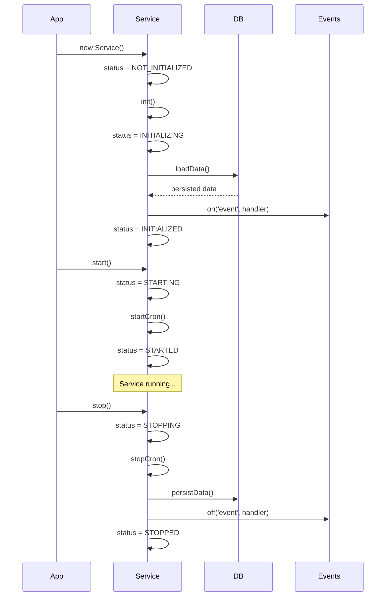

## What are Services?

Services are the core business logic layer in SubWallet Extension. They encapsulate complex functionality, manage state, handle API interactions, and coordinate data flow between different parts of the application.

Services provide:
- **Lifecycle management** with init, start, stop methods
- **State management** through RxJS observables
- **Data persistence** integration with stores and database
- **Event-driven architecture** for loosely coupled components
- **Cron job support** for periodic tasks

## Service Interfaces

SubWallet defines several interfaces that services can implement:

### CoreServiceInterface

The foundation for all services:

```typescript
export interface CoreServiceInterface {
  status: ServiceStatus;
  init: () => Promise<void>;
  startPromiseHandler: PromiseHandler<void>;
  start: () => Promise<void>;
  waitForStarted: () => Promise<void>;
}
```

### StoppableServiceInterface

For services that need cleanup:

```typescript
export interface StoppableServiceInterface extends CoreServiceInterface {
  stopPromiseHandler: PromiseHandler<void>;
  stop: () => Promise<void>;
  waitForStopped: () => Promise<void>;
}
```

### PersistDataServiceInterface

For services that manage persistent data:

```typescript
export interface PersistDataServiceInterface {
  loadData: () => Promise<void>;
  persistData: () => Promise<void>;
}
```

### CronServiceInterface

For services with periodic tasks:

```typescript
export interface CronServiceInterface {
  startCron: () => Promise<void>;
  stopCron: () => Promise<void>;
}
```

## Service Statuses

```typescript
export enum ServiceStatus {
  NOT_INITIALIZED = 'not_initialized',
  INITIALIZING = 'initializing',
  INITIALIZED = 'initialized',
  STARTED = 'started',
  STARTING = 'starting',
  STARTED_FULL = 'started_full',
  STARTING_FULL = 'starting_full',
  STOPPED = 'stopped',
  STOPPING = 'stopping',
}
```

## Creating a New Service

### Step 1: Define Your Service Structure

Create a new directory in `packages/extension-base/src/services/`:

```
services/
  my-service/
    index.ts          # Main service class
    types.ts          # Service-specific types
    helpers/          # Helper functions
      index.ts
```

### Step 2: Implement the Service Class

Here's a complete example based on the PriceService:

```typescript
// services/price-service/index.ts
import { ServiceStatus, StoppableServiceInterface, PersistDataServiceInterface, CronServiceInterface } from '../base/types';
import { ChainService } from '../chain-service';
import { EventService } from '../event-service';
import DatabaseService from '../storage-service/DatabaseService';
import { CurrentCurrencyStore } from '@subwallet/extension-base/stores';
import { createPromiseHandler } from '@subwallet/extension-base/utils/promise';
import { BehaviorSubject } from 'rxjs';

export class PriceService implements StoppableServiceInterface, PersistDataServiceInterface, CronServiceInterface {
  status: ServiceStatus;
  private dbService: DatabaseService;
  private eventService: EventService;
  private chainService: ChainService;
  private priceSubject: BehaviorSubject<PriceJson>;
  private refreshTimeout: NodeJS.Timeout | undefined;
  private readonly currency = new CurrentCurrencyStore();

  constructor (dbService: DatabaseService, eventService: EventService, chainService: ChainService) {
    this.status = ServiceStatus.NOT_INITIALIZED;
    this.dbService = dbService;
    this.eventService = eventService;
    this.chainService = chainService;
    this.priceSubject = new BehaviorSubject({ /* default data */ });

    // Auto-initialize
    this.init().catch(console.error);
  }

  // Initialize service
  async init (): Promise<void> {
    this.status = ServiceStatus.INITIALIZING;
    
    // Load persisted data
    await this.loadData();
    
    // Setup event listeners
    this.eventService.on('asset.updateState', this.handleAssetUpdate);
    
    this.status = ServiceStatus.INITIALIZED;
  }

  // Start service operations
  startPromiseHandler = createPromiseHandler<void>();

  async start (): Promise<void> {
    if (this.status === ServiceStatus.STARTED) {
      return;
    }

    try {
      this.startPromiseHandler = createPromiseHandler<void>();
      this.status = ServiceStatus.STARTING;
      
      // Wait for dependencies
      await this.eventService.waitAssetReady;
      
      // Start cron jobs
      await this.startCron();
      
      this.status = ServiceStatus.STARTED;
      this.startPromiseHandler.resolve();
    } catch (e) {
      this.startPromiseHandler.reject(e);
    }
  }

  // Stop service operations
  stopPromiseHandler = createPromiseHandler<void>();

  async stop (): Promise<void> {
    try {
      this.status = ServiceStatus.STOPPING;
      this.stopPromiseHandler = createPromiseHandler<void>();
      
      await this.stopCron();
      await this.persistData();
      
      this.status = ServiceStatus.STOPPED;
      this.stopPromiseHandler.resolve();
    } catch (e) {
      this.stopPromiseHandler.reject(e);
    }
  }

  // Cron job management
  async startCron (): Promise<void> {
    this.refreshData();
  }

  async stopCron (): Promise<void> {
    clearTimeout(this.refreshTimeout);
  }

  private refreshData = () => {
    // Fetch latest data
    this.fetchPriceData()
      .then(() => this.priceSubject.next(/* updated data */))
      .catch(console.error);

    // Schedule next refresh
    this.refreshTimeout = setTimeout(this.refreshData, 60000);
  };

  // Data persistence
  async loadData (): Promise<void> {
    const data = await this.dbService.getPriceStore();
    this.priceSubject.next(data || DEFAULT_DATA);
  }

  async persistData (): Promise<void> {
    await this.dbService.updatePriceStore(this.priceSubject.value);
  }

  // Public API
  public getPriceSubject () {
    return this.priceSubject;
  }

  async waitForStarted (): Promise<void> {
    return this.startPromiseHandler.promise;
  }

  async waitForStopped (): Promise<void> {
    return this.stopPromiseHandler.promise;
  }
}
```

### Step 3: Integrate with KoniState

Add your service to the main state handler:

```typescript
// koni/background/handlers/State.ts
import { PriceService } from '@subwallet/extension-base/services/price-service';

export default class KoniState extends State {
  public readonly priceService: PriceService;

  constructor () {
    super();
    
    // Initialize service
    this.priceService = new PriceService(
      this.dbService,
      this.eventService,
      this.chainService
    );
  }

  // Start all services
  async startServices () {
    await Promise.all([
      this.priceService.start(),
      // other services...
    ]);
  }

  // Stop all services
  async stopServices () {
    await Promise.all([
      this.priceService.stop(),
      // other services...
    ]);
  }
}
```

## Real-World Example: ChainService

The ChainService manages blockchain connections and chain metadata:

```typescript
export class ChainService {
  private dataMap: _DataMap = {
    chainInfoMap: {},
    chainStateMap: {},
    assetRegistry: {},
    assetRefMap: {}
  };

  private dbService: DatabaseService;
  private eventService: EventService;
  private substrateChainHandler: SubstrateChainHandler;
  private evmChainHandler: EvmChainHandler;

  constructor (dbService: DatabaseService, eventService: EventService) {
    this.dbService = dbService;
    this.eventService = eventService;
    
    // Initialize chain handlers
    this.substrateChainHandler = new SubstrateChainHandler();
    this.evmChainHandler = new EvmChainHandler();
  }

  // Public methods
  public getChainInfoMap (): Record<string, _ChainInfo> {
    return this.dataMap.chainInfoMap;
  }

  public getAssetRegistry (): Record<string, _ChainAsset> {
    return this.dataMap.assetRegistry;
  }

  public async enableChain (chainSlug: string): Promise<boolean> {
    const chainInfo = this.dataMap.chainInfoMap[chainSlug];
    
    if (!chainInfo) {
      return false;
    }

    // Update state
    this.dataMap.chainStateMap[chainSlug].active = true;
    
    // Persist changes
    await this.dbService.upsertChain(chainInfo);
    
    // Emit event
    this.eventService.emit('chain.updateState', chainSlug);
    
    return true;
  }
}
```

## Service Communication Patterns

### Pattern 1: Event-Driven Updates

```typescript
export class BalanceService {
  constructor (private eventService: EventService, private chainService: ChainService) {
    // Listen to chain updates
    this.eventService.on('chain.updateState', this.handleChainUpdate);
    this.eventService.on('account.updateCurrent', this.handleAccountUpdate);
  }

  private handleChainUpdate = (chainSlug: string) => {
    // Refresh balances for affected chain
    this.refreshChainBalance(chainSlug);
  };

  private handleAccountUpdate = (account: AccountInfo) => {
    // Refresh all balances for new account
    this.refreshAllBalances(account.address);
  };
}
```

### Pattern 2: Observable State

```typescript
export class PriceService {
  private priceSubject: BehaviorSubject<PriceJson>;

  public getPriceSubject () {
    return this.priceSubject;
  }

  public subscribePrice (priceId: string, callback: (price: number) => void) {
    return this.priceSubject.pipe(
      map(data => data.priceMap[priceId]),
      distinctUntilChanged()
    ).subscribe(callback);
  }
}
```

### Pattern 3: Service Dependencies

```typescript
export class EarningService {
  constructor (
    private chainService: ChainService,
    private balanceService: BalanceService,
    private priceService: PriceService
  ) {
    // Service depends on other services
  }

  async calculateEarnings (address: string): Promise<EarningInfo> {
    const chains = this.chainService.getActiveChains();
    const balances = await this.balanceService.getBalances(address);
    const prices = this.priceService.getPriceSubject().value;
    
    // Combine data from multiple services
    return this.computeEarnings(chains, balances, prices);
  }
}
```

## Best Practices

### 1. Lazy Initialization

```typescript
// Good: Wait for dependencies
async start (): Promise<void> {
  await this.eventService.waitAssetReady;
  await this.chainService.waitForReady();
  // Now safe to start
}

// Bad: Start without dependencies
async start (): Promise<void> {
  // Might fail if dependencies not ready
  this.fetchData();
}
```

### 2. Graceful Shutdown

```typescript
async stop (): Promise<void> {
  // 1. Stop accepting new work
  this.status = ServiceStatus.STOPPING;
  
  // 2. Stop background tasks
  await this.stopCron();
  
  // 3. Persist important data
  await this.persistData();
  
  // 4. Cleanup resources
  this.cleanup();
  
  // 5. Mark as stopped
  this.status = ServiceStatus.STOPPED;
}
```

### 3. Error Handling

```typescript
private async fetchData () {
  try {
    const data = await this.apiCall();
    this.dataSubject.next(data);
  } catch (error) {
    console.error('Failed to fetch data:', error);
    // Don't crash the service, use cached data
    this.dataSubject.next(this.cachedData);
  }
}
```

### 4. Memory Management

```typescript
export class MyService {
  private subscriptions: Subscription[] = [];

  async start () {
    // Store subscriptions for cleanup
    this.subscriptions.push(
      this.eventService.on('event', this.handler)
    );
  }

  async stop () {
    // Cleanup subscriptions
    this.subscriptions.forEach(sub => sub.unsubscribe());
    this.subscriptions = [];
  }
}
```

### 5. Testing Services

```typescript
describe('PriceService', () => {
  let service: PriceService;
  let mockDb: DatabaseService;
  let mockEvents: EventService;

  beforeEach(() => {
    mockDb = createMockDatabase();
    mockEvents = createMockEventService();
    service = new PriceService(mockDb, mockEvents, mockChainService);
  });

  afterEach(async () => {
    await service.stop();
  });

  it('should load persisted data on init', async () => {
    await service.init();
    const data = service.getPriceSubject().value;
    expect(data).toBeDefined();
  });
});
```

## Service Lifecycle



## Common Service Types

### Data Fetching Services
- **PriceService**: Fetches and caches token prices
- **BalanceService**: Manages account balances across chains
- **NftService**: Handles NFT metadata and ownership

### State Management Services
- **ChainService**: Manages chain configurations and connections
- **KeyringService**: Handles account keys and signing
- **SettingService**: Manages user preferences

### Background Processing Services
- **HistoryService**: Processes transaction history
- **EarningService**: Calculates staking rewards
- **NotificationService**: Manages in-app notifications

## Related Concepts

- [Stores](/developers/concepts/stores) - Persist service data
- [APIs](/developers/concepts/apis) - Services use APIs to fetch data
- [Cron Jobs](/developers/concepts/cron-jobs) - Schedule periodic service tasks