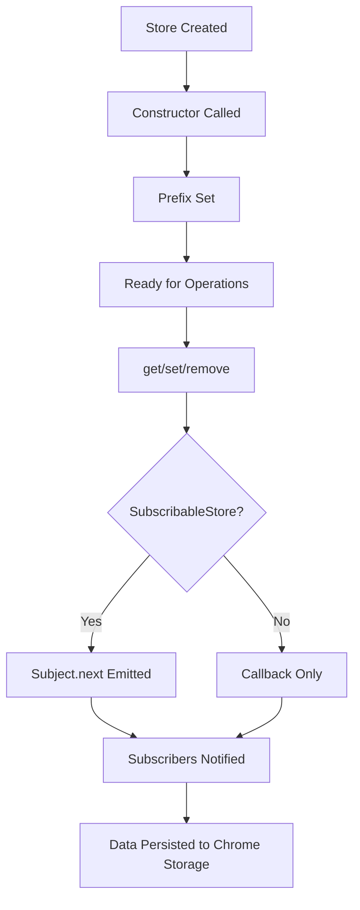

## What are Stores?

Stores are data persistence layers in SubWallet Extension that handle saving and retrieving data from Chrome's local storage. They provide a clean abstraction over the browser storage API and enable reactive data patterns through RxJS subjects.

Stores are essential for:
- **Persisting user data** across browser sessions
- **Reactive data flow** through observable patterns
- **Type-safe storage** with TypeScript interfaces
- **Namespaced data** to avoid key conflicts

## Store Architecture

SubWallet implements two types of stores:

### BaseStore

The foundation class that provides basic CRUD operations with Chrome storage:

```typescript
export default abstract class BaseStore <T> {
  #prefix: string;

  constructor (prefix: string | null) {
    this.#prefix = prefix ? `${prefix}:` : '';
  }

  public get (_key: string, update: (value: T) => void): void
  public set (_key: string, value: T, update?: () => void): void
  public remove (_key: string, update?: () => void): void
  public all (update: (key: string, value: T) => void): void
  public allMap (update: (value: Record<string, T>) => void): void
}
```

**Key Features:**
- Prefix-based namespacing to avoid storage key collisions
- Callback-based async operations
- Automatic error handling via `chrome.runtime.lastError`

### SubscribableStore

Extends `BaseStore` with reactive capabilities using RxJS:

```typescript
export default abstract class SubscribableStore<T> extends BaseStore<T> {
  private readonly subject: Subject<T> = new Subject<T>();

  public getSubject (): Subject<T> {
    return this.subject;
  }

  public override set (_key: string, value: T, update?: () => void): void {
    super.set(_key, value, () => {
      this.subject.next(value);
      update && update();
    });
  }

  public asyncGet = async (key: string): Promise<T> => {
    return new Promise((resolve) => {
      this.get(key, resolve);
    });
  };
}
```

**Key Features:**
- RxJS Subject emits on every data change
- Promise-based `asyncGet` for modern async/await syntax
- Automatic notification to all subscribers when data changes

## Creating a New Store

### Step 1: Define Your Store Class

Create a new file in `packages/extension-base/src/stores/`:

```typescript
// CurrentAccountStore.ts
import { EXTENSION_PREFIX } from '@subwallet/extension-base/defaults';
import SubscribableStore from '@subwallet/extension-base/stores/SubscribableStore';
import { CurrentAccountInfo } from '@subwallet/extension-base/types';

export default class CurrentAccountStore extends SubscribableStore<CurrentAccountInfo> {
  constructor () {
    super(EXTENSION_PREFIX ? `${EXTENSION_PREFIX}current_account` : null);
  }
}
```

**Important:**
- Use `SubscribableStore` if you need reactive updates
- Use `BaseStore` for simple key-value storage
- Always prefix with `EXTENSION_PREFIX` for namespace isolation
- Use descriptive, unique keys for your store

### Step 2: Define the Data Type

Ensure your data type is defined in the appropriate types file:

```typescript
// background/KoniTypes.ts
export interface CurrentAccountInfo {
  address: string;
  currentAccountType: AccountType;
  proxyId?: string;
}
```

### Step 3: Integrate into KoniState

Add your store to the state management class:

```typescript
// koni/background/handlers/State.ts
export default class KoniState extends State {
  private readonly currentAccountStore = new CurrentAccountStore();
  private currentAccountReady = false;

  // Setter method
  public setCurrentAccount (accountInfo: CurrentAccountInfo, callback?: () => void): void {
    this.currentAccountStore.set('CurrentAccount', accountInfo, () => {
      this.eventService.emit('account.updateCurrent', accountInfo);
      callback && callback();
    });
  }

  // Getter method
  public getCurrentAccount (update: (value: CurrentAccountInfo) => void): void {
    if (!this.currentAccountReady) {
      this.currentAccountStore.get('CurrentAccount', (value) => {
        this.currentAccountReady = true;
        update(value);
      });
    } else {
      this.currentAccountStore.get('CurrentAccount', update);
    }
  }

  // Subscribe method for reactive updates
  public subscribeCurrentAccount () {
    return this.currentAccountStore.getSubject();
  }
}
```

### Step 4: Export Your Store

Add your store to the index file:

```typescript
// stores/index.ts
export { default as CurrentAccountStore } from './CurrentAccountStore';
```

## Real-World Example: SettingsStore

Here's how the SettingsStore is implemented:

```typescript
import { RequestSettingsType } from '@subwallet/extension-base/background/KoniTypes';
import { EXTENSION_PREFIX } from '@subwallet/extension-base/defaults';
import SubscribableStore from '@subwallet/extension-base/stores/SubscribableStore';

export default class SettingsStore extends SubscribableStore<RequestSettingsType> {
  constructor () {
    super(EXTENSION_PREFIX ? `${EXTENSION_PREFIX}settings` : null);
  }
}
```

Usage in KoniState:

```typescript
private readonly settingsStore = new SettingsStore();

public getSettings (update: (value: RequestSettingsType) => void): void {
  this.settingsStore.get('Settings', update);
}

public setSettings (settings: RequestSettingsType, callback?: () => void): void {
  this.settingsStore.set('Settings', settings, callback);
}

public subscribeSettings () {
  return this.settingsStore.getSubject();
}
```

## Best Practices

### 1. Choose the Right Base Class

- **Use `SubscribableStore`** when:
  - UI needs real-time updates
  - Multiple components depend on the data
  - Data changes frequently
  
- **Use `BaseStore`** when:
  - Data is read once at startup
  - Simple configuration storage
  - No need for reactive updates

### 2. Storage Keys

```typescript
// Good: Descriptive and unique
super(EXTENSION_PREFIX ? `${EXTENSION_PREFIX}current_account` : null);

// Bad: Too generic, potential conflicts
super(EXTENSION_PREFIX ? `${EXTENSION_PREFIX}data` : null);
```

### 3. Type Safety

Always define proper TypeScript interfaces:

```typescript
// Good
export interface PriceJson {
  currency: CurrencyType;
  priceMap: Record<string, number>;
  ready: boolean;
}

class PriceStore extends SubscribableStore<PriceJson> {}

// Bad
class PriceStore extends SubscribableStore<any> {}
```

### 4. Ready State Pattern

Implement ready flags to prevent redundant storage reads:

```typescript
private priceStoreReady = false;

public getPrice (update: (value: PriceJson) => void): void {
  if (!this.priceStoreReady) {
    this.priceStore.get('Price', (value) => {
      this.priceStoreReady = true;
      update(value);
    });
  } else {
    this.priceStore.get('Price', update);
  }
}
```

### 5. Event Emission

Emit events when data changes to trigger dependent systems:

```typescript
public setPrice (priceData: PriceJson, callback?: () => void): void {
  this.priceStore.set('Price', priceData, () => {
    this.eventService.emit('price.updated', priceData);
    callback && callback();
  });
}
```

### 6. Error Handling

BaseStore automatically logs errors, but add application-level handling:

```typescript
public async loadSettings (): Promise<RequestSettingsType> {
  try {
    return await this.settingsStore.asyncGet('Settings');
  } catch (error) {
    console.error('Failed to load settings:', error);
    return DEFAULT_SETTINGS; // Fallback
  }
}
```

## Common Patterns

### Pattern 1: Cache with Store Backup

```typescript
private cachedData: PriceJson | null = null;

public async getPrice (): Promise<PriceJson> {
  if (this.cachedData) {
    return this.cachedData;
  }
  
  this.cachedData = await this.priceStore.asyncGet('Price');
  return this.cachedData;
}
```

### Pattern 2: Subscribe with Initial Value

```typescript
public subscribePrice (callback: (value: PriceJson) => void) {
  // Send current value immediately
  this.getPrice(callback);
  
  // Subscribe to future changes
  return this.priceStore.getSubject().subscribe(callback);
}
```

### Pattern 3: Batch Updates

```typescript
public async updateMultipleSettings (updates: Partial<RequestSettingsType>) {
  const current = await this.settingsStore.asyncGet('Settings');
  const merged = { ...current, ...updates };
  
  return new Promise<void>((resolve) => {
    this.settingsStore.set('Settings', merged, resolve);
  });
}
```

## Debugging Stores

### View Storage Contents

In Chrome DevTools:
1. Open **Developer Tools** > **Application** > **Local Storage**
2. Look for keys prefixed with your `EXTENSION_PREFIX`
3. Inspect values (stored as JSON)

### Subscribe to Changes

```typescript
// In console or debugging code
this.priceStore.getSubject().subscribe((value) => {
  console.log('Price updated:', value);
});
```

### Common Issues

**Issue: Data not persisting**
```typescript
// Wrong: Callback not executed
this.store.set('key', value); // No callback

// Right: Wait for persistence
this.store.set('key', value, () => console.log('Saved'));
```

**Issue: Subject not emitting**
```typescript
// Wrong: Using BaseStore instead of SubscribableStore
class MyStore extends BaseStore<T> {}

// Right: Use SubscribableStore for reactive updates
class MyStore extends SubscribableStore<T> {}
```

## Store Lifecycle



## Related Concepts

- [Services](/developers/concepts/services) - Use stores for service data persistence
- [APIs](/developers/concepts/apis) - Store API responses for caching
- [Cron Jobs](/developers/concepts/cron-jobs) - Periodically update store data